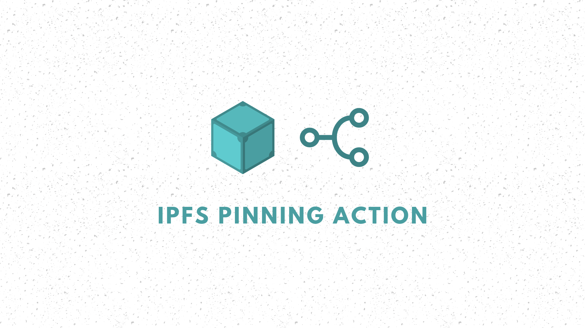

# IPFS Pinning GitHub Action

This GitHub Action helps you to publish your website/assets to IPFS Pinning Services (e.g. [Pinata](https://pinata.cloud/documentation#PinningServicesAPI) or [Filebase](https://docs.filebase.com/api-documentation/ipfs-pinning-service-api) using the official [IPFS Remote Pinning API](https://ipfs.github.io/pinning-services-api-spec/).
## Usage
You can use this Action directly from your GitHub workflow. You can find the required credentials on your Pinning Services Website.

```yaml
#/.github/workflows/main.yml
on: [push]

jobs:
  pin_to_ipfs:
    runs-on: ubuntu-latest
    name: Publish
    steps:
    - uses: actions/checkout@v2
    - name: IPFS Publish
      id: IPFS
      uses: alexanderschau/ipfs-pinning-action@v1.0.0
      with:
        path_to_add: 'your/path/' #Required
        endpoint: ${{ secrets.ENDPOINT }} #Required
        access_token: ${{ secrets.ACCESS_TOKEN }} #Required
        pin_name: 'github-actions-test' #Optional
```
## Outputs
### `cid`
Your content's IPFS content identifier e.g.

`bafkreicysg23kiwv34eg2d7qweipxwosdo2py4ldv42nbauguluen5v6am`
## Contribute
If you have ideas to improve this action or found a bug, feel free to submit a PR or open an issue.
## License
MIT © Alexander Schau
